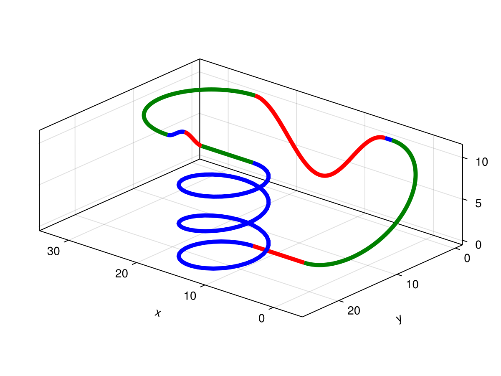
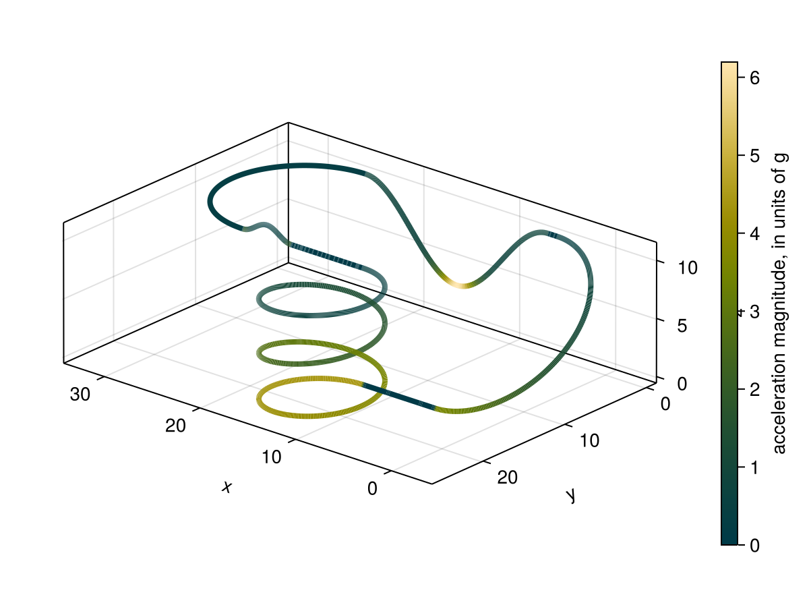

# RollerCoasterSimulator

A short project designed to model the dynamics of a roller coaster. 

This project needs the following packages:
- CairoMakie
- Dates

`main.jl` provides an example of the intended use. 

